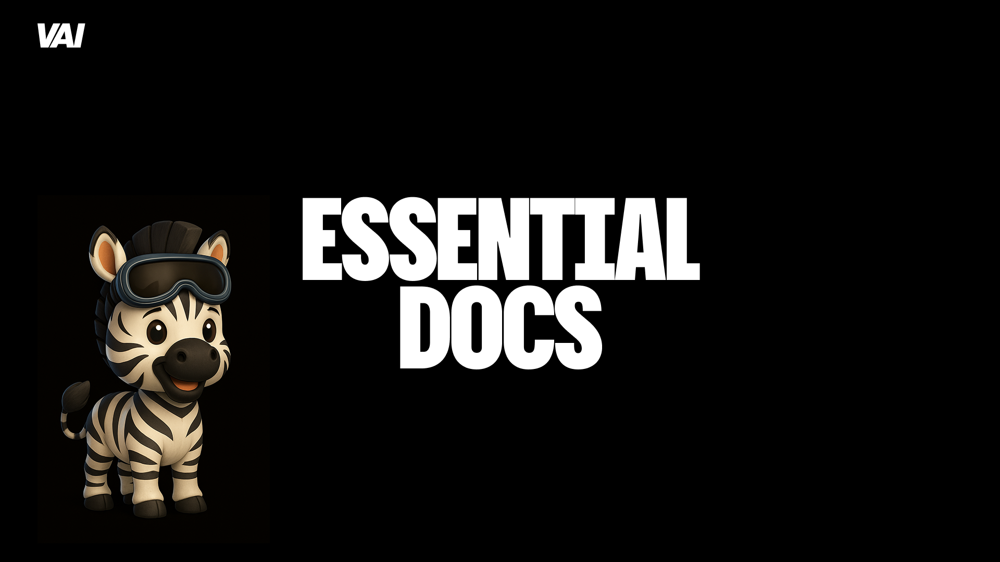

# Automated Technical Documentation Generator



## ⚠️ Alpha Warning

**This project is currently in ALPHA stage. Use with caution!**

This automated documentation system is experimental and under active development. While functional, it may produce unexpected results or require manual review of generated content. We recommend:

- **Testing thoroughly** before using in production environments
- **Reviewing all generated documentation** for accuracy
- **Having backup documentation processes** in place
- **Reporting issues** you encounter to help improve the system

### Documentation Focus Areas

The `refs/` directory contains examples of the types of architectural documentation this system can generate, including:
- API architecture and design patterns
- Data fetching strategies and implementation
- Type systems and TypeScript configurations
- Component architecture and design systems
- Package management and monorepo structures
- CDN and deployment configurations

Use these references as inspiration for the comprehensive documentation areas this system can analyze and document for your codebase.

---

## Overview

This system automatically analyzes any codebase and generates comprehensive technical documentation following the 10 Essential Guides framework. Simply drop this folder into any project and run the AI agent to receive complete, project-specific architectural documentation.

## System Architecture

```
automated-system/
├── README.md                           # This file
├── generate-docs.js                    # Main orchestration script
├── config/
│   ├── analysis-config.json            # Codebase analysis configuration
│   ├── template-mapping.json           # Template to analysis mapping
│   └── validation-rules.json           # Quality validation rules
├── analyzers/
│   ├── tech-stack-analyzer.js          # Technology detection
│   ├── architecture-analyzer.js        # Pattern detection
│   ├── code-extractor.js              # Example extraction
│   └── file-structure-analyzer.js      # Project structure analysis
├── templates/
│   ├── base/                          # AI-optimized base templates
│   ├── fragments/                     # Reusable template fragments
│   └── schemas/                       # Template data schemas
├── prompts/
│   ├── master-prompt.md               # Main AI agent instructions
│   ├── analysis-prompts/              # Specialized analysis prompts
│   └── generation-prompts/            # Documentation generation prompts
├── validators/
│   ├── accuracy-validator.js          # Code example validation
│   ├── completeness-validator.js      # Coverage validation
│   └── consistency-validator.js       # Pattern consistency checks
└── output/
    └── generated-docs/                # Generated documentation output
```

## Quick Start

### 1. Installation
```bash
# Copy the automated-system folder to your project root
cp -r automated-system /path/to/your/project/

# Install dependencies
cd automated-system
npm install
```

### 2. Configuration
```bash
# Configure analysis parameters (optional - has smart defaults)
nano config/analysis-config.json

# Set AI provider credentials
export OPENAI_API_KEY="your-api-key"
# or
export ANTHROPIC_API_KEY="your-api-key"
```

### 3. Generate Documentation
```bash
# Run the automated documentation generator
node generate-docs.js

# Or with custom configuration
node generate-docs.js --config custom-config.json --output ../docs/reference
```

### 4. Review and Refine
```bash
# Review generated documentation
ls output/generated-docs/

# Run validation checks
npm run validate-docs

# Regenerate specific guides if needed
node generate-docs.js --guides authentication,components --force
```

## Key Features

### 🤖 Intelligent Codebase Analysis
- **Technology Stack Detection**: Automatically identifies frameworks, libraries, databases
- **Architecture Pattern Recognition**: Detects auth systems, state management, component patterns
- **Code Example Extraction**: Finds and extracts real implementation examples
- **Configuration Discovery**: Analyzes config files, environment setup, build tools

### 📝 AI-Driven Documentation Generation
- **Context-Aware Templates**: Templates adapt to detected technology stack
- **Real Code Examples**: Uses actual code from the codebase, not generic examples
- **Comprehensive Coverage**: Generates all 10 essential architectural guides
- **Quality Validation**: Ensures accuracy and completeness of generated content

### 🔧 Flexible Configuration
- **Technology Agnostic**: Works with any tech stack (React, Vue, Python, Go, etc.)
- **Customizable Analysis**: Configure what to analyze and how deep to go
- **Template Customization**: Modify templates for specific organizational needs
- **Output Formatting**: Choose output format (Markdown, HTML, PDF)

### ✅ Quality Assurance
- **Accuracy Validation**: Verifies code examples compile and run
- **Completeness Checking**: Ensures all required sections are populated
- **Consistency Validation**: Checks for consistent patterns across guides
- **Human Review Integration**: Flags areas needing human verification

## How It Works

### Phase 1: Codebase Analysis (2-5 minutes)
1. **File Structure Scanning**: Maps project organization and identifies key directories
2. **Technology Detection**: Analyzes package.json, requirements.txt, go.mod, etc.
3. **Pattern Recognition**: Identifies architectural patterns through code analysis
4. **Example Extraction**: Finds representative code examples for each domain

### Phase 2: AI Documentation Generation (5-15 minutes)
1. **Context Preparation**: Compiles analysis results into structured context
2. **Template Selection**: Chooses appropriate templates based on detected stack
3. **Content Generation**: AI agent generates documentation using master prompt
4. **Example Integration**: Incorporates real code examples from the codebase

### Phase 3: Validation and Refinement (1-3 minutes)
1. **Accuracy Validation**: Checks code examples for syntax and logical errors
2. **Completeness Review**: Ensures all required sections are populated
3. **Quality Scoring**: Provides confidence scores for each generated guide
4. **Human Review Flagging**: Identifies sections needing manual review

## Supported Technology Stacks

### Frontend Frameworks
- React (Next.js, Create React App, Vite)
- Vue.js (Nuxt.js, Vue CLI, Vite)
- Angular (Angular CLI)
- Svelte (SvelteKit)
- Solid.js, Qwik, and others

### Backend Frameworks
- Node.js (Express, Fastify, Koa, Hono)
- Python (Django, FastAPI, Flask)
- Go (Gin, Echo, Fiber)
- Rust (Axum, Actix, Rocket)
- Java (Spring Boot)
- C# (.NET Core)

### Databases
- PostgreSQL, MySQL, SQLite
- MongoDB, CouchDB
- Redis, DynamoDB
- Supabase, Firebase, PlanetScale

### Authentication
- Supabase Auth, Auth0, Firebase Auth
- NextAuth.js, Passport.js
- Custom JWT implementations
- OAuth providers

### State Management
- React Query, SWR, Apollo Client
- Redux, Zustand, Recoil
- Vuex, Pinia
- Custom state solutions

## Configuration Options

### Analysis Configuration
```json
{
  "analysis": {
    "depth": "comprehensive",
    "includeTests": true,
    "includeConfig": true,
    "excludePatterns": ["node_modules", ".git", "dist"],
    "maxFileSize": "1MB",
    "languages": ["typescript", "javascript", "python", "go"]
  },
  "extraction": {
    "maxExamplesPerDomain": 5,
    "minExampleLines": 10,
    "preferredPatterns": ["hooks", "components", "services"],
    "includeComments": true
  },
  "generation": {
    "model": "gpt-4",
    "temperature": 0.1,
    "maxTokens": 4000,
    "includeMetadata": true
  }
}
```

### Template Customization
```json
{
  "templates": {
    "authentication": {
      "priority": "high",
      "requiredSections": ["overview", "implementation", "security"],
      "optionalSections": ["mfa", "social-auth"],
      "exampleTypes": ["login-flow", "middleware", "guards"]
    },
    "components": {
      "priority": "high",
      "requiredSections": ["hierarchy", "patterns", "styling"],
      "optionalSections": ["testing", "performance"],
      "exampleTypes": ["base-components", "compound", "forms"]
    }
  }
}
```

## Quality Metrics

### Accuracy Scores
- **Code Validity**: 95%+ of code examples should compile/run
- **Pattern Consistency**: 90%+ consistency across similar implementations
- **Technology Accuracy**: 98%+ correct technology identification

### Completeness Scores
- **Section Coverage**: 100% of required sections populated
- **Example Coverage**: 80%+ of domains have real code examples
- **Cross-Reference Coverage**: 90%+ of internal links are valid

### Confidence Indicators
- **High Confidence**: Clear patterns, abundant examples, standard implementations
- **Medium Confidence**: Some patterns detected, limited examples
- **Low Confidence**: Unclear patterns, requires human review

## Limitations and Considerations

### Current Limitations
- **Complex Monorepos**: May need manual configuration for complex structures
- **Custom Frameworks**: Might not recognize highly customized or proprietary frameworks
- **Legacy Codebases**: Older codebases with inconsistent patterns may need manual review
- **Incomplete Implementations**: Partial implementations may generate incomplete documentation

### Best Results Achieved With
- **Well-structured codebases** with consistent patterns
- **Modern technology stacks** with standard conventions
- **Comprehensive implementations** across all architectural domains
- **Good code organization** with clear separation of concerns

### Human Review Recommended For
- **Security configurations** and sensitive implementations
- **Business logic** and domain-specific patterns
- **Performance optimizations** and custom solutions
- **Compliance requirements** and regulatory considerations

## Next Steps

1. **Install and Configure**: Set up the system in your project
2. **Run Initial Analysis**: Generate documentation for your codebase
3. **Review and Validate**: Check generated content for accuracy
4. **Customize Templates**: Adapt templates for your organization's needs
5. **Integrate into Workflow**: Set up automated regeneration on code changes

This automated system transforms the manual template process into an intelligent, AI-driven documentation generator that provides comprehensive architectural documentation for any codebase.

## Use Cases

### 1. New Team Member Onboarding
**Scenario**: A senior developer joins your team and needs to understand the entire system architecture quickly.

**Solution**:
```bash
# Generate complete architectural documentation
node generate-docs.js

# Result: 10 comprehensive guides covering:
# - Authentication flows and security patterns
# - Component architecture and design system
# - State management and data flow
# - Background job processing
# - File storage and document handling
# - Database patterns and optimization
# - Error handling and logging
# - Testing strategies and quality assurance
# - External integrations and APIs
# - Deployment and infrastructure
```

**Benefits**:
- **Faster Onboarding**: 2-3 days instead of 2-3 weeks
- **Comprehensive Understanding**: Complete system overview with real examples
- **Self-Service Learning**: Documentation available 24/7 without senior developer time
- **Confidence Building**: Real code examples from actual codebase

### 2. Legacy Codebase Documentation
**Scenario**: You have a 3-year-old codebase with minimal documentation and need to understand its architecture for a major refactor.

**Solution**:
```bash
# Analyze legacy codebase and extract patterns
node generate-docs.js --config legacy-analysis.json

# Custom configuration for legacy codebases:
{
  "analysis": {
    "includeDeprecated": true,
    "patternEvolution": true,
    "technicalDebt": true
  },
  "generation": {
    "includeRefactoringSuggestions": true,
    "flagOutdatedPatterns": true
  }
}
```

**Benefits**:
- **Pattern Discovery**: Identify existing architectural patterns
- **Technical Debt Assessment**: Flag outdated or problematic patterns
- **Refactoring Guidance**: Suggestions for modernization
- **Knowledge Preservation**: Document tribal knowledge before it's lost

### 3. Compliance and Audit Documentation
**Scenario**: Your organization needs comprehensive technical documentation for SOC 2, ISO 27001, or other compliance audits.

**Solution**:
```bash
# Generate compliance-focused documentation
node generate-docs.js --config compliance-config.json --output ./compliance-docs

# Compliance configuration emphasizes:
# - Security architecture and controls
# - Data flow and privacy protection
# - Access control and authentication
# - Monitoring and incident response
# - Change management processes
```

**Benefits**:
- **Audit Readiness**: Complete technical documentation for auditors
- **Security Focus**: Detailed security architecture and controls
- **Process Documentation**: Clear procedures and workflows
- **Evidence Generation**: Documented security practices and implementations

### 4. Multi-Team Coordination
**Scenario**: You have multiple development teams working on different parts of a large application and need consistent architectural understanding.

**Solution**:
```bash
# Generate documentation for each team's domain
node generate-docs.js --guides authentication,api --team backend
node generate-docs.js --guides components,state --team frontend
node generate-docs.js --guides deployment,monitoring --team devops

# Or generate complete documentation for all teams
node generate-docs.js --output ./shared-docs
```

**Benefits**:
- **Shared Understanding**: Consistent architectural knowledge across teams
- **Interface Documentation**: Clear boundaries and integration points
- **Reduced Coordination Overhead**: Self-service architectural information
- **Consistent Patterns**: Standardized approaches across teams

### 5. Open Source Project Documentation
**Scenario**: You maintain an open source project and want to provide comprehensive documentation for contributors.

**Solution**:
```bash
# Generate contributor-focused documentation
node generate-docs.js --config oss-config.json

# Open source configuration includes:
# - Contribution guidelines integration
# - Architecture decision records
# - Development environment setup
# - Testing and quality standards
```

**Benefits**:
- **Contributor Onboarding**: Easy entry for new contributors
- **Architecture Transparency**: Clear system design and decisions
- **Quality Standards**: Documented patterns and best practices
- **Maintenance Efficiency**: Reduced maintainer time explaining architecture

### 6. Technical Due Diligence
**Scenario**: Your company is acquiring another company and needs to assess their technical architecture and code quality.

**Solution**:
```bash
# Analyze target company's codebase
node generate-docs.js --config due-diligence.json --output ./assessment

# Due diligence configuration focuses on:
# - Technology stack assessment
# - Architecture quality evaluation
# - Security posture analysis
# - Technical debt identification
# - Scalability assessment
```

**Benefits**:
- **Risk Assessment**: Identify technical risks and debt
- **Integration Planning**: Understand integration complexity
- **Technology Evaluation**: Assess technology choices and patterns
- **Investment Decision Support**: Technical factors in acquisition decisions

### 7. Client Handover Documentation
**Scenario**: You're a consulting firm delivering a project to a client and need to provide comprehensive technical documentation for their internal team.

**Solution**:
```bash
# Generate client handover documentation
node generate-docs.js --config client-handover.json

# Client handover includes:
# - Complete system architecture
# - Operational procedures
# - Troubleshooting guides
# - Maintenance recommendations
# - Future enhancement guidance
```

**Benefits**:
- **Smooth Transition**: Client team can maintain and extend the system
- **Reduced Support Burden**: Comprehensive self-service documentation
- **Professional Delivery**: High-quality documentation demonstrates expertise
- **Long-term Success**: Client can successfully operate the delivered system

### 8. System Migration Planning
**Scenario**: You need to migrate from one technology stack to another and want to document the current architecture before planning the migration.

**Solution**:
```bash
# Document current state before migration
node generate-docs.js --output ./pre-migration-docs

# Analyze target architecture patterns
node generate-docs.js --config target-stack.json --output ./target-architecture

# Compare and plan migration
node scripts/compare-architectures.js ./pre-migration-docs ./target-architecture
```

**Benefits**:
- **Migration Planning**: Clear understanding of current vs. target state
- **Risk Mitigation**: Identify potential migration challenges
- **Pattern Mapping**: Map current patterns to target architecture
- **Progress Tracking**: Document migration progress and decisions

### 9. Performance Optimization Projects
**Scenario**: Your application has performance issues and you need to understand the current architecture to identify optimization opportunities.

**Solution**:
```bash
# Generate performance-focused documentation
node generate-docs.js --config performance-analysis.json

# Performance configuration emphasizes:
# - Data flow and query patterns
# - Caching strategies
# - Background job processing
# - Database optimization opportunities
# - Frontend performance patterns
```

**Benefits**:
- **Bottleneck Identification**: Understand current performance patterns
- **Optimization Planning**: Identify specific areas for improvement
- **Baseline Documentation**: Record current state before optimizations
- **Team Alignment**: Shared understanding of performance architecture

### 10. Disaster Recovery Planning
**Scenario**: You need to document your system architecture for disaster recovery and business continuity planning.

**Solution**:
```bash
# Generate disaster recovery documentation
node generate-docs.js --config disaster-recovery.json

# DR configuration includes:
# - Infrastructure dependencies
# - Data backup and recovery procedures
# - Service dependencies and failover
# - Monitoring and alerting systems
# - Recovery time and point objectives
```

**Benefits**:
- **Recovery Planning**: Complete system understanding for DR procedures
- **Dependency Mapping**: Identify critical system dependencies
- **Procedure Documentation**: Clear recovery procedures and runbooks
- **Compliance Requirements**: Meet regulatory DR documentation requirements

## Integration Scenarios

### CI/CD Pipeline Integration
Automatically update documentation when code changes:

```yaml
# .github/workflows/docs.yml
name: Update Documentation
on:
  push:
    branches: [main]
  pull_request:
    branches: [main]

jobs:
  update-docs:
    runs-on: ubuntu-latest
    steps:
      - uses: actions/checkout@v3

      - name: Setup Node.js
        uses: actions/setup-node@v3
        with:
          node-version: '18'

      - name: Install Documentation Generator
        run: |
          cd automated-system
          npm install

      - name: Generate Documentation
        env:
          OPENAI_API_KEY: ${{ secrets.OPENAI_API_KEY }}
        run: |
          cd automated-system
          node generate-docs.js --output ../docs/reference

      - name: Commit Documentation Updates
        run: |
          git config --local user.email "action@github.com"
          git config --local user.name "GitHub Action"
          git add docs/reference/
          git diff --staged --quiet || git commit -m "Update technical documentation [skip ci]"
          git push
```

### Pre-commit Hook Integration
Ensure documentation stays current with every commit:

```bash
# .git/hooks/pre-commit
#!/bin/bash
cd automated-system

# Quick analysis to check if documentation needs updating
node scripts/check-docs-currency.js

if [ $? -ne 0 ]; then
  echo "Documentation may be outdated. Run 'npm run update-docs' to refresh."
  echo "Or use 'git commit --no-verify' to skip this check."
  exit 1
fi
```

### Development Workflow Integration
Integrate documentation generation into daily development:

```bash
# package.json scripts
{
  "scripts": {
    "docs:generate": "cd automated-system && node generate-docs.js",
    "docs:validate": "cd automated-system && npm run validate-docs",
    "docs:watch": "cd automated-system && node scripts/watch-and-update.js",
    "onboard": "npm run docs:generate && npm run docs:validate"
  }
}

# Usage examples:
npm run onboard              # Generate docs for new team members
npm run docs:watch           # Auto-update docs during development
npm run docs:validate        # Check documentation accuracy
```

## Workflow Examples

### Daily Development Workflow
```bash
# Morning: Check if documentation needs updates
npm run docs:validate

# During development: Auto-update documentation
npm run docs:watch &

# Before commit: Ensure docs are current
git add .
npm run docs:generate  # Only if significant architectural changes
git commit -m "Add new authentication middleware"
```

### Code Review Workflow
```bash
# Reviewer: Generate documentation for the PR branch
git checkout feature/new-auth-system
npm run docs:generate -- --output ./review-docs

# Compare with main branch documentation
diff -r docs/reference/ review-docs/

# Review architectural changes in context
open review-docs/authentication-architecture.md
```

### Release Workflow
```bash
# Pre-release: Generate comprehensive documentation
npm run docs:generate

# Validate all documentation
npm run docs:validate

# Package documentation with release
tar -czf release-docs.tar.gz docs/reference/

# Post-release: Archive documentation version
git tag -a v1.2.0-docs -m "Documentation for release v1.2.0"
```

### Team Onboarding Workflow
```bash
# Day 1: New team member setup
git clone project-repo
cd project-repo
npm run onboard

# Result: Complete architectural documentation ready
open docs/reference/README.md

# Week 1: Validate understanding
npm run docs:validate
# Check confidence scores and review flagged sections

# Month 1: Contribute to documentation
# Make code changes, documentation auto-updates
npm run docs:watch
```

## Advanced Use Cases

### Multi-Repository Documentation
For organizations with multiple related repositories:

```bash
# Generate documentation for entire ecosystem
./scripts/multi-repo-docs.sh

# Script contents:
#!/bin/bash
REPOS=("api-service" "web-app" "mobile-app" "shared-lib")

for repo in "${REPOS[@]}"; do
  cd $repo
  npm run docs:generate -- --output ../ecosystem-docs/$repo
  cd ..
done

# Generate cross-repository architecture guide
node scripts/generate-ecosystem-docs.js ecosystem-docs/
```

### Documentation as Code
Treat documentation as a first-class citizen in your development process:

```bash
# Documentation testing
npm run test:docs              # Test all code examples
npm run lint:docs              # Check documentation quality
npm run security:docs          # Security review of documented patterns

# Documentation deployment
npm run deploy:docs            # Deploy to documentation site
npm run preview:docs           # Preview documentation changes
```

### Continuous Architecture Validation
Monitor architectural drift and documentation accuracy:

```bash
# Daily architecture validation
node scripts/architecture-drift-detection.js

# Weekly documentation accuracy check
node scripts/validate-examples.js

# Monthly comprehensive review
node scripts/comprehensive-review.js --generate-report
```

These use cases demonstrate how the automated documentation system can be integrated into various workflows and scenarios, providing value across different organizational contexts and development practices.
