# API Architecture Guide - Midday Project

## Architecture Overview Diagrams

### 1. High-Level System Architecture


### 2. Request Flow Diagram


### 3. Authentication Flow


### 4. Data Access Patterns Decision Tree


### 5. Middleware Stack Visualization


### 6. Database Routing Strategy


## Architecture Components Summary

| Component | Primary Purpose | When to Use | Key Benefits | Integration Points |
|-----------|----------------|-------------|--------------|-------------------|
| **Hono Web Framework** | HTTP request/response handling, middleware orchestration | All API endpoints (both tRPC and REST) | Fast performance, lightweight, excellent TypeScript support, OpenAPI integration | • Hosts tRPC server adapter<br/>• Serves REST endpoints<br/>• Manages CORS and security headers<br/>• Integrates with OpenAPI documentation |
| **tRPC Server** | Type-safe internal API procedures with business logic | Dashboard-specific operations requiring validation, authorization, and type safety | End-to-end TypeScript inference, automatic serialization, middleware composition, React Query integration | • Runs on Hono framework<br/>• Uses Supabase for auth verification<br/>• Connects to Drizzle ORM for database access<br/>• Provides types to dashboard clients |
| **tRPC Client** | Type-safe API consumption in React components | All dashboard data fetching and mutations | Automatic type inference, optimistic updates, caching, error handling | • Consumes API router types<br/>• Integrates with React Query<br/>• Uses Supabase client for authentication<br/>• Provides hooks for React components |
| **Supabase Auth** | JWT-based authentication and session management | User login/logout, session validation, MFA operations | Secure authentication, social providers, built-in security features | • Issues JWT tokens for API access<br/>• Validates user credentials<br/>• Integrates with both dashboard and API<br/>• Provides real-time auth state |
| **Supabase Storage** | File upload/download and blob storage | Document uploads, image storage, file management | Direct client uploads, CDN integration, signed URLs, automatic optimization | • Direct client-to-storage uploads<br/>• Bypasses API for performance<br/>• Integrates with tRPC for metadata<br/>• Provides signed URL generation |
| **Supabase Realtime** | Live database subscriptions and WebSocket connections | Real-time UI updates, collaborative features, live notifications | Low latency, automatic reconnection, filtered subscriptions | • Direct client connections<br/>• Triggers React Query cache invalidation<br/>• Bypasses HTTP API layer<br/>• Provides real-time data sync |
| **Drizzle ORM** | Type-safe database queries with multi-region support | All database operations requiring custom SQL, complex queries, performance optimization | Type safety, SQL-like syntax, migration support, connection pooling | • Used by tRPC procedures<br/>• Handles primary/replica routing<br/>• Provides schema definitions<br/>• Supports complex aggregations |
| **React Query** | Client-side caching, background updates, optimistic mutations | All dashboard data fetching and state management | Automatic caching, background refetching, optimistic updates, error recovery | • Integrates with tRPC client<br/>• Manages cache invalidation<br/>• Handles loading states<br/>• Provides offline support |
| **OpenAPI/Zod** | Schema validation and API documentation generation | External REST API endpoints, input validation, documentation | Automatic documentation, runtime validation, type generation, SDK generation | • Validates REST endpoint inputs<br/>• Generates interactive documentation<br/>• Provides schema-driven development<br/>• Enables external integrations |
| **Primary/Replica DBs** | Multi-region database with intelligent routing | All database operations with consistency and performance requirements | Read scalability, geographic distribution, automatic failover, consistency guarantees | • Routes through Drizzle ORM<br/>• Managed by middleware<br/>• Supports replication lag handling<br/>• Provides regional optimization |

## Frequently Asked Questions (FAQ)

### **Q: Why use tRPC instead of just REST APIs for everything?**

**A:** While REST APIs are excellent for external integrations, tRPC provides significant advantages for internal dashboard communication:

- **End-to-End Type Safety**: Changes to API procedures automatically update TypeScript types in the dashboard, catching errors at compile time
- **Developer Experience**: Auto-completion, refactoring support, and runtime validation reduce development time and bugs
- **Optimized for React**: Built-in React Query integration provides automatic caching, background updates, and optimistic mutations
- **Reduced Boilerplate**: No need to manually write API clients, type definitions, or serialization logic

**Example**: When you change a database schema, tRPC automatically updates all related types across the entire stack, while REST would require manual updates to multiple files.

### **Q: Why are there so many different data access patterns? Isn't this overly complex?**

**A:** Each pattern serves specific use cases and optimizes for different requirements:

**Direct Supabase** (Authentication, Storage, Real-time):
- **Why**: These operations benefit from direct client connections for performance and real-time capabilities
- **Example**: File uploads go directly to Supabase Storage to avoid API bandwidth limits and provide resumable uploads

**tRPC Procedures** (Business Logic, Dashboard Operations):
- **Why**: Complex operations requiring validation, authorization, and type safety
- **Example**: Updating similar transactions requires business rules, team validation, and cache invalidation

**Direct Database Queries** (Performance-Critical, Background Jobs):
- **Why**: Maximum performance for complex aggregations and operations that don't need HTTP overhead
- **Example**: Analytics queries with complex JOINs and aggregations run faster with direct SQL

### **Q: What are the trade-offs between complexity and benefits?**

**Trade-offs**:
- **Complexity**: More moving parts, steeper learning curve, additional abstractions
- **Benefits**: Type safety, performance optimization, developer productivity, maintainability

**Why the benefits outweigh the complexity**:
1. **Prevents Runtime Errors**: Type safety catches issues at compile time rather than in production
2. **Faster Development**: Auto-completion and type inference reduce development time
3. **Better Performance**: Each layer is optimized for its specific use case
4. **Easier Maintenance**: Clear separation of concerns makes debugging and updates easier

### **Q: When should new developers choose one approach over another?**

**Quick Decision Guide**:

```typescript
// ✅ Use Direct Supabase for:
await supabase.auth.signIn({ email, password }); // Authentication
await supabase.storage.from('vault').upload(file); // File uploads
supabase.channel('transactions').subscribe(); // Real-time updates

// ✅ Use tRPC for:
trpc.transactions.updateSimilar.mutate({ ... }); // Business logic
trpc.customers.get.useQuery({ ... }); // Dashboard data fetching
trpc.team.updateSettings.mutate({ ... }); // Complex validations

// ✅ Use Direct Database for:
getComplexAnalytics(db, { teamId, dateRange }); // Performance-critical queries
processBatchTransactions(db, transactions); // Background jobs
searchFullText(db, { query, filters }); // Advanced database features
```

### **Q: How does this architecture scale and what are the performance implications?**

**Scalability Features**:
- **Database Replicas**: Read operations scale horizontally across multiple regions
- **Intelligent Routing**: Mutations use primary DB, queries use regional replicas
- **Caching Layers**: React Query (client), LRU caches (API), and database query caching
- **Direct Connections**: File uploads and real-time features bypass API bottlenecks

**Performance Optimizations**:
- **Request Batching**: tRPC automatically batches multiple requests
- **Prefetching**: Server-side data loading for faster page loads
- **Optimistic Updates**: Immediate UI feedback with rollback on errors
- **Regional Distribution**: Database replicas reduce latency globally

### **Q: Why not use a simpler, single-layer approach?**

**Problems with simpler approaches**:

**Single REST API Layer**:
- ❌ No compile-time type safety between frontend and backend
- ❌ Manual API client maintenance and type definitions
- ❌ Suboptimal for real-time features and file uploads
- ❌ No automatic caching or optimistic updates

**Direct Database Access from Frontend**:
- ❌ Security vulnerabilities and data exposure risks
- ❌ No business logic validation or authorization
- ❌ Difficult to implement complex operations and transactions
- ❌ Poor separation of concerns and maintainability

### **Q: What specific problems does this multi-layered architecture solve?**

**Real-World Problems Solved**:

1. **Type Safety Across the Stack**:
   - **Problem**: Frontend-backend type mismatches causing runtime errors
   - **Solution**: tRPC provides end-to-end TypeScript inference

2. **Performance at Scale**:
   - **Problem**: Single database becoming a bottleneck
   - **Solution**: Multi-region replicas with intelligent routing

3. **Developer Productivity**:
   - **Problem**: Slow development due to manual API client maintenance
   - **Solution**: Auto-generated types and React hooks

4. **Real-Time Features**:
   - **Problem**: Complex WebSocket management and state synchronization
   - **Solution**: Direct Supabase real-time with automatic cache invalidation

5. **File Upload Performance**:
   - **Problem**: Large file uploads overwhelming API servers
   - **Solution**: Direct client-to-storage uploads with metadata via tRPC

6. **External Integration Requirements**:
   - **Problem**: Third-party developers need standard REST APIs
   - **Solution**: OpenAPI-documented REST endpoints alongside internal tRPC

**Bottom Line**: This architecture optimizes for both developer experience and runtime performance while maintaining security and scalability. Each layer serves a specific purpose and could not be easily replaced without losing significant benefits.

## Infrastructure and Deployment

### Fly.io Multi-Region Deployment Architecture

The Midday API is deployed on Fly.io with a sophisticated multi-region strategy that aligns with the database replica architecture:

#### **Production Deployment Configuration**

```toml
# apps/api/fly.toml
app = 'midday-api'
primary_region = 'fra'  # Frankfurt as primary region

[http_service]
  internal_port = 8080
  force_https = true
  auto_stop_machines = 'off'
  auto_start_machines = true
  min_machines_running = 3  # High availability
  processes = ['app']

[[vm]]
  memory = '8gb'           # High memory for database connections
  cpu_kind = 'shared'
  cpus = 4
```

#### **Regional Deployment Strategy**

The API is deployed across three strategic regions that correspond directly to database replicas:

| Fly.io Region | Database Replica | Geographic Coverage | Purpose |
|---------------|------------------|-------------------|---------|
| **FRA** (Frankfurt) | `DATABASE_FRA_URL` | Europe, Middle East, Africa | Primary region, lowest latency for EU users |
| **IAD** (Virginia) | `DATABASE_IAD_URL` | North America East Coast | US East Coast users, backup for FRA |
| **SJC** (San Jose) | `DATABASE_SJC_URL` | North America West Coast, Asia-Pacific | US West Coast and Asia-Pacific users |

#### **Environment-Based Deployment**

```yaml
# .github/workflows/production-api.yaml
- name: 🚀 Deploy to Fly Production
  run: flyctl deploy --remote-only --dockerfile apps/api/Dockerfile --config apps/api/fly.toml
  env:
    FLY_API_TOKEN: ${{ secrets.FLY_API_TOKEN }}

# .github/workflows/preview-api.yaml
- name: 🚀 Deploy to Fly Preview
  run: flyctl deploy --remote-only --dockerfile apps/api/Dockerfile --config apps/api/fly-preview.yml
```

**Environment Differences**:
- **Production**: 3 minimum machines, 8GB memory, auto-stop disabled
- **Preview/Staging**: 1 minimum machine, 512MB memory, auto-stop enabled

#### **Database Region Routing Logic**

The `FLY_REGION` environment variable automatically routes database connections to the nearest replica:

```typescript
// apps/api/src/db/index.ts
const getReplicaIndexForRegion = () => {
  switch (process.env.FLY_REGION) {
    case "fra":
      return 0;  // Frankfurt replica
    case "iad":
      return 1;  // Virginia replica
    case "sjc":
      return 2;  // San Jose replica
    default:
      return 0;  // Default to Frankfurt
  }
};

export const connectDb = async () => {
  const replicaIndex = getReplicaIndexForRegion();

  return withReplicas(
    primaryDb,
    [
      drizzle(fraPool, { schema, casing: "snake_case" }),  // Index 0
      drizzle(iadPool, { schema, casing: "snake_case" }),  // Index 1
      drizzle(sjcPool, { schema, casing: "snake_case" }),  // Index 2
    ],
    (replicas) => replicas[replicaIndex]!,
  );
};
```

#### **Health Checks and Monitoring**

```typescript
// apps/api/src/utils/health.ts
export async function checkHealth() {
  const db = await connectDb();
  await db.executeOnReplica(sql`SELECT 1`);
}

// Health endpoint in main application
app.get("/health", async (c) => {
  try {
    await checkHealth();
    return c.json({ status: "ok" }, 200);
  } catch (error) {
    return c.json({ status: "error" }, 500);
  }
});
```

**Monitoring Features**:
- **Database Connectivity**: Health checks verify replica connections
- **Regional Performance**: Each region monitors its local database replica
- **Automatic Failover**: Fly.io handles machine failures and restarts
- **Load Balancing**: Traffic distributed across available machines

#### **Environment Configuration and Secrets**

**Environment Variables Structure**:
```bash
# Database connections (region-specific)
DATABASE_PRIMARY_URL=""    # Frankfurt primary (write operations)
DATABASE_FRA_URL=""        # Frankfurt replica (EU reads)
DATABASE_SJC_URL=""        # San Jose replica (US West reads)
DATABASE_IAD_URL=""        # Virginia replica (US East reads)

# Session pooler for migrations
DATABASE_SESSION_POOLER="" # Used by Drizzle Kit

# Regional API configuration
FLY_REGION=""             # Automatically set by Fly.io
ALLOWED_API_ORIGINS=""    # Dashboard origins for CORS

# External services
SUPABASE_URL=""
SUPABASE_SERVICE_KEY=""
SUPABASE_JWT_SECRET=""
```

**Secrets Management**:
- **Fly.io Secrets**: Database URLs, API keys, JWT secrets stored securely
- **GitHub Secrets**: CI/CD tokens and deployment credentials
- **Environment Separation**: Different secrets for production, staging, and preview
- **Automatic Injection**: Secrets automatically available as environment variables

#### **CI/CD Pipeline Integration**

**Deployment Pipeline**:
1. **Code Quality Checks**: Linting, TypeScript validation, unit tests
2. **Dependency Building**: Build `@midday/engine` package
3. **Docker Build**: Multi-stage build with Bun runtime
4. **Fly.io Deployment**: Remote Docker build and deployment
5. **Health Verification**: Automatic health checks post-deployment

**Build Optimization**:
```dockerfile
# apps/api/Dockerfile
FROM oven/bun:1.2.13 AS base

# Turbo CLI for monorepo optimization
FROM base AS turbo-cli
RUN bun add -g turbo

# Prune workspace for minimal build context
FROM turbo-cli AS builder
WORKDIR /app
COPY . .
RUN turbo prune @midday/api --docker

# Optimized dependency installation
FROM base AS installer
WORKDIR /app
COPY --from=builder /app/out/json/ .
RUN bun install
COPY --from=builder /app/out/full/ .
```

## Database Management and Migrations

### Migration Architecture and Tooling

The Midday project uses **Drizzle ORM** with **Drizzle Kit** for comprehensive database lifecycle management across multiple environments and regions.

#### **Drizzle Kit Configuration**

```typescript
// apps/api/drizzle.config.ts
import type { Config } from "drizzle-kit";

export default {
  schema: "./src/db/schema.ts",           // Single source of truth for schema
  out: "./migrations",                   // Generated migration files
  dialect: "postgresql",                 // PostgreSQL-specific optimizations
  dbCredentials: {
    url: process.env.DATABASE_SESSION_POOLER!, // Session pooler for migrations
  },
} satisfies Config;
```

#### **Schema Organization and Structure**

The database schema is organized in a single, comprehensive file that serves as the source of truth:

```typescript
// apps/api/src/db/schema.ts (excerpt)
export const teams = pgTable(
  "teams",
  {
    id: uuid().defaultRandom().primaryKey().notNull(),
    createdAt: timestamp("created_at", { withTimezone: true, mode: "string" })
      .defaultNow()
      .notNull(),
    name: text(),
    logoUrl: text("logo_url"),
    inboxId: text("inbox_id").default("generate_inbox(10)"),
    baseCurrency: text("base_currency"),
    plan: plansEnum().default("trial").notNull(),
  },
  (table) => ({
    // Row Level Security policies
    enableRLS: pgPolicy("Enable RLS", {
      as: "permissive",
      for: "all",
      to: ["authenticated"],
    }),
  }),
);

// Full-text search with generated columns
export const documents = pgTable("documents", {
  id: uuid().defaultRandom().primaryKey().notNull(),
  title: text(),
  body: text(),
  fts: tsvector("fts")
    .notNull()
    .generatedAlwaysAs(
      (): SQL => sql`to_tsvector('english'::regconfig, ((title || ' '::text) || body))`,
    ),
  teamId: uuid("team_id"),
  // ... other columns
});
```

**Schema Features**:
- **Type Safety**: Full TypeScript integration with runtime validation
- **Row Level Security**: Built-in RLS policies for multi-tenant security
- **Full-Text Search**: Generated tsvector columns for search functionality
- **JSON/JSONB Support**: Structured data storage with type safety
- **Array Types**: Native PostgreSQL array support
- **Generated Columns**: Computed columns for search and indexing

#### **Migration Generation and Execution**

**Available Migration Commands**:
```bash
# Generate migrations from schema changes
bun run db:pull                    # Pull schema from database
drizzle-kit generate              # Generate migration from schema changes
drizzle-kit migrate               # Apply pending migrations
drizzle-kit studio                # Visual database browser
```

**Migration File Structure**:
```
apps/api/migrations/
├── meta/
│   ├── _journal.json             # Migration history and metadata
│   └── 0000_snapshot.json        # Complete schema snapshot
└── 0000_bumpy_chat.sql           # Generated SQL migration
```

**Example Migration File**:
```sql
-- apps/api/migrations/0000_bumpy_chat.sql
CREATE TABLE "teams" (
  "id" uuid PRIMARY KEY DEFAULT gen_random_uuid() NOT NULL,
  "created_at" timestamp with time zone DEFAULT now() NOT NULL,
  "name" text,
  "logo_url" text,
  "base_currency" text,
  "plan" "plans_enum" DEFAULT 'trial' NOT NULL
);

-- Enable Row Level Security
ALTER TABLE "teams" ENABLE ROW LEVEL SECURITY;

-- Create full-text search index
CREATE INDEX "documents_fts_idx" ON "documents" USING gin("fts");
```

#### **Multi-Environment Migration Strategy**

**Environment-Specific Execution**:

1. **Development Environment**:
   ```bash
   # Local development with session pooler
   DATABASE_SESSION_POOLER="postgresql://..." drizzle-kit migrate
   ```

2. **Staging Environment**:
   ```bash
   # Staging database with preview data
   DATABASE_SESSION_POOLER="postgresql://staging..." drizzle-kit migrate
   ```

3. **Production Environment**:
   ```bash
   # Production with careful rollout
   DATABASE_SESSION_POOLER="postgresql://prod..." drizzle-kit migrate
   ```

#### **Primary/Replica Migration Coordination**

**Migration Execution Flow**:
1. **Primary Database**: All migrations execute on the primary database first
2. **Replication Lag**: Allow time for changes to propagate to replicas
3. **Validation**: Verify schema consistency across all replicas
4. **Application Deployment**: Deploy application changes after database migrations

```typescript
// Migration coordination with replica awareness
const migrationStrategy = {
  // 1. Execute on primary database
  primary: process.env.DATABASE_PRIMARY_URL,

  // 2. Verify replication to all regions
  replicas: [
    process.env.DATABASE_FRA_URL,
    process.env.DATABASE_IAD_URL,
    process.env.DATABASE_SJC_URL,
  ],

  // 3. Wait for replication lag (typically 1-5 seconds)
  replicationDelay: 10000, // 10 seconds safety margin
};
```

#### **Schema Versioning and Rollback Strategies**

**Version Control Integration**:
- **Git-Based Versioning**: Migration files tracked in version control
- **Atomic Migrations**: Each migration is a single, atomic transaction
- **Forward-Only**: Migrations are designed to be forward-compatible
- **Rollback Planning**: Critical migrations include rollback procedures

**Rollback Strategies**:
```sql
-- Example rollback-safe migration
-- Forward migration: Add nullable column
ALTER TABLE "transactions" ADD COLUMN "new_field" text;

-- Rollback strategy: Drop column if needed
-- ALTER TABLE "transactions" DROP COLUMN "new_field";

-- Forward migration: Populate data
UPDATE "transactions" SET "new_field" = 'default_value' WHERE "new_field" IS NULL;

-- Forward migration: Add constraint
ALTER TABLE "transactions" ALTER COLUMN "new_field" SET NOT NULL;
```

#### **Type System Integration**

**Automatic Type Generation**:
```typescript
// Schema changes automatically update TypeScript types
export type Team = typeof teams.$inferSelect;
export type NewTeam = typeof teams.$inferInsert;

// tRPC procedures automatically inherit updated types
export const teamRouter = createTRPCRouter({
  create: protectedProcedure
    .input(insertTeamSchema)  // Automatically updated from schema
    .mutation(async ({ input, ctx: { db, teamId } }) => {
      return db.insert(teams).values(input).returning();
    }),
});
```

**Type Propagation Flow**:
1. **Schema Changes**: Developer modifies `schema.ts`
2. **Migration Generation**: Drizzle Kit generates SQL migration
3. **Type Updates**: TypeScript types automatically updated
4. **tRPC Integration**: API procedures inherit new types
5. **Dashboard Updates**: Frontend components get updated types
6. **Compile-Time Validation**: TypeScript catches breaking changes

#### **Database Seeding and Initial Data**

**Seeding Strategy**:
```typescript
// Database seeding for development and testing
const seedDatabase = async () => {
  const db = await connectDb();

  // Create default team
  const [team] = await db.insert(teams).values({
    name: "Default Team",
    plan: "trial",
  }).returning();

  // Create default user
  await db.insert(users).values({
    id: "default-user-id",
    fullName: "Default User",
    teamId: team.id,
  });

  // Create sample data for development
  await db.insert(transactions).values([
    {
      teamId: team.id,
      amount: 100.00,
      currency: "USD",
      name: "Sample Transaction",
    },
  ]);
};
```

#### **Backup and Recovery Procedures**

**Automated Backup Strategy**:
- **Supabase Managed Backups**: Automatic daily backups with point-in-time recovery
- **Cross-Region Replication**: Data automatically replicated across regions
- **Migration Rollback**: Ability to rollback schema changes if needed

**Recovery Procedures**:
1. **Point-in-Time Recovery**: Restore database to specific timestamp
2. **Schema Rollback**: Revert to previous migration state
3. **Data Recovery**: Restore specific tables or records
4. **Cross-Region Failover**: Switch to replica region if primary fails

**Backup Verification**:
```typescript
// Verify backup integrity
const verifyBackup = async () => {
  const db = await connectDb();

  // Check critical tables exist and have data
  const teamCount = await db.select({ count: sql`count(*)` }).from(teams);
  const userCount = await db.select({ count: sql`count(*)` }).from(users);

  if (teamCount[0].count === 0 || userCount[0].count === 0) {
    throw new Error("Backup verification failed: Missing critical data");
  }
};
```

This comprehensive database management strategy ensures data consistency, type safety, and reliable deployments across the entire Midday platform while maintaining the performance benefits of the multi-region replica architecture.

## Understanding Database Replicas: A Developer's Guide

If you're new to database replication, this section will help you understand one of the most important architectural decisions in the Midday platform. Don't worry if this seems complex at first - we'll break it down step by step.

### What Are Database Replicas? (The Library Analogy)

Think of database replicas like a global library system:

- **Main Library (Primary Database)**: There's one main library in Frankfurt where all new books are added, cataloged, and organized. This is the only place where librarians can add or modify books.

- **Branch Libraries (Replica Databases)**: There are branch libraries in Frankfurt, Virginia, and San Jose. These branches have copies of all the books from the main library, but they're read-only - you can't add new books there.

- **Automatic Updates**: When a new book is added to the main library, it automatically appears at all branch libraries within a few minutes.

- **Smart Routing**: When you want to read a book, you automatically go to your nearest branch library for faster access. But if you want to donate a new book, you have to go to the main library.

### Database Replica Architecture Diagram

```mermaid
graph TD
    subgraph "Write Operations (Always Primary)"
        WRITE_USER[👤 User Creates Transaction]
        WRITE_API[🌐 API Instance<br/>Any Region]
        WRITE_PRIMARY[(🏛️ Primary Database<br/>Frankfurt<br/>✍️ READ + WRITE)]

        WRITE_USER --> WRITE_API
        WRITE_API --> WRITE_PRIMARY
    end

    subgraph "Automatic Replication (Supabase Managed)"
        WRITE_PRIMARY -->|📡 Streaming Replication<br/>1-5 seconds| REPLICA_FRA
        WRITE_PRIMARY -->|📡 Streaming Replication<br/>1-5 seconds| REPLICA_IAD
        WRITE_PRIMARY -->|📡 Streaming Replication<br/>1-5 seconds| REPLICA_SJC
    end

    subgraph "Read Operations (Regional Replicas)"
        REPLICA_FRA[(📚 Frankfurt Replica<br/>👁️ READ ONLY)]
        REPLICA_IAD[(📚 Virginia Replica<br/>👁️ READ ONLY)]
        REPLICA_SJC[(📚 San Jose Replica<br/>👁️ READ ONLY)]

        EU_USER[👤 EU User] --> API_FRA[🌐 API Frankfurt]
        US_EAST_USER[👤 US East User] --> API_IAD[🌐 API Virginia]
        US_WEST_USER[👤 US West User] --> API_SJC[🌐 API San Jose]

        API_FRA --> REPLICA_FRA
        API_IAD --> REPLICA_IAD
        API_SJC --> REPLICA_SJC
    end

    style WRITE_PRIMARY fill:#ffebee
    style REPLICA_FRA fill:#e8f5e8
    style REPLICA_IAD fill:#e8f5e8
    style REPLICA_SJC fill:#e8f5e8
    style WRITE_USER fill:#e3f2fd
    style EU_USER fill:#e3f2fd
    style US_EAST_USER fill:#e3f2fd
    style US_WEST_USER fill:#e3f2fd
```



### How Read and Write Operations Work

#### **Read Operations: Fast and Local**

When you want to view your dashboard, the system prioritizes speed:

```typescript
// apps/api/src/db/replicas.ts
const select: Q["select"] = (...args: []) =>
  getDbForRead().select(...args);  // Uses nearest replica

const getDbForRead = () => {
  // Returns replica database for fast reads
  return getReplica(replicas);  // Frankfurt, Virginia, or San Jose
};
```

**Read Operation Flow**:
1. 👤 User opens dashboard in California
2. 🌐 Request hits API server in San Jose (nearest region)
3. 📚 API queries San Jose replica database (same region = fast!)
4. ⚡ Data returned quickly with low latency

#### **Write Operations: Consistent and Reliable**

When you create or modify data, the system prioritizes consistency:

```typescript
// apps/api/src/db/replicas.ts
const insert: Q["insert"] = (...args: [any]) =>
  primary.insert(...args);  // ALWAYS uses primary database

const update: Q["update"] = (...args: [any]) =>
  primary.update(...args);  // ALWAYS uses primary database
```

**Write Operation Flow**:
1. 👤 User creates transaction in California
2. 🌐 Request hits API server in San Jose
3. 🏛️ API sends write to PRIMARY database in Frankfurt
4. ✍️ Primary database processes the write
5. 📡 Change automatically syncs to all replicas (1-5 seconds)
6. ✅ User's next read will see the new data

### Real-World Examples

#### **Example 1: California User Views Dashboard (Read Operation)**

```typescript
// User in California opens their transactions page
const { data: transactions } = useQuery(
  trpc.transactions.get.queryOptions({
    pageSize: 20,
  }),
);

// Behind the scenes:
// 1. Request → San Jose API server (closest to California)
// 2. API → San Jose replica database (same region)
// 3. Fast response with low latency ⚡
```

**Why this is fast**: The data travels a short distance (within the same region), so the response time is typically under 50ms.

#### **Example 2: California User Creates Transaction (Write Operation)**

```typescript
// User creates a new transaction
const { mutate } = useMutation(
  trpc.transactions.create.mutationOptions({
    amount: 100.00,
    description: "Coffee shop",
  }),
);

// Behind the scenes:
// 1. Request → San Jose API server
// 2. API → Frankfurt PRIMARY database (consistency required)
// 3. Write processed and confirmed
// 4. Data syncs to all replicas within 1-5 seconds
// 5. User's next read will see the new transaction ✅
```

**Why this route is necessary**: All writes must go to the primary database to prevent conflicts and ensure data consistency across all regions.

### Handling Replication Lag: The "Read Your Own Writes" Problem

**The Problem**: After you create a transaction, there's a small delay (1-5 seconds) before it appears in the replica databases. If you immediately refresh your dashboard, you might not see your new transaction!

**The Solution**: Primary-Read-After-Write pattern

```typescript
// apps/api/src/trpc/middleware/primary-read-after-write.ts
export const withPrimaryReadAfterWrite = async (opts) => {
  const { ctx, type } = opts;
  const teamId = ctx.teamId;

  if (type === "mutation") {
    // User just performed a write operation
    const expiryTime = Date.now() + 10000; // 10 seconds from now
    cache.set(teamId, expiryTime);

    // Use primary database for this write
    ctx.db = ctx.db.usePrimaryOnly();
  } else {
    // User is performing a read operation
    const timestamp = cache.get(teamId);
    const now = Date.now();

    if (timestamp && now < timestamp) {
      // User recently wrote data, use primary for consistency
      ctx.db = ctx.db.usePrimaryOnly();
    }
    // Otherwise use replica for speed
  }
};
```

**How it works**:
1. ✍️ User creates a transaction → System remembers "this team just wrote data"
2. 👁️ User immediately views dashboard → System thinks "they might want to see their new data"
3. 🏛️ System uses primary database for reads (slower but guaranteed to have latest data)
4. ⏰ After 10 seconds → System goes back to using fast replicas

### Benefits of This Architecture

#### **🚀 Performance Benefits**

- **Low Latency Reads**: Users read from nearby replicas
  - EU users: ~20ms (Frankfurt replica)
  - US East users: ~30ms (Virginia replica)
  - US West users: ~40ms (San Jose replica)

- **Reduced Database Load**: Read traffic distributed across multiple databases
- **Geographic Optimization**: Data served from the closest location

#### **🔒 Consistency Benefits**

- **Single Source of Truth**: All writes go to one primary database
- **No Write Conflicts**: Impossible to have conflicting writes
- **Eventual Consistency**: All replicas eventually have the same data
- **Read-Your-Own-Writes**: Users always see their own changes immediately

#### **🛡️ Reliability Benefits**

- **Redundancy**: Multiple copies of data in different regions
- **Disaster Recovery**: If one region fails, others continue working
- **Automatic Failover**: Supabase handles replica failures transparently
- **Zero Downtime**: Replica maintenance doesn't affect other regions

### Common Developer Questions

**Q: What happens if the primary database goes down?**
A: Supabase automatically promotes one of the replicas to become the new primary. This process takes a few minutes, during which writes are temporarily unavailable, but reads continue working from other replicas.

**Q: Can I force a read to use the primary database?**
A: Yes! Use the `usePrimaryOnly()` method:
```typescript
const db = await connectDb();
const freshData = await db.usePrimaryOnly().select().from(transactions);
```

**Q: How do I know which database my query is using?**
A: The system automatically chooses based on the operation type and recent write activity. You can check the logs to see which database connection is being used.

**Q: What's the cost of this architecture?**
A: Replica databases cost extra, but the performance and reliability benefits usually justify the cost for production applications with global users.

This replica architecture might seem complex, but it's what enables Midday to provide fast, reliable service to users around the world while maintaining data consistency and reliability.

## Overview

The Midday project implements a dual-layer API architecture that serves both internal dashboard requests and external third-party integrations. The architecture combines **Supabase** as the database and authentication backend with **tRPC** as the type-safe API layer for internal use, and **REST/OpenAPI** endpoints for external consumption.

## Architecture Components

### Technology Stack
- **Supabase**: Database (PostgreSQL), authentication, and real-time subscriptions
- **tRPC**: Type-safe internal API layer with automatic TypeScript inference
- **Hono**: Fast dashboard framework for REST API endpoints
- **OpenAPI/Zod**: Schema validation and API documentation generation
- **Drizzle ORM**: Type-safe database queries with multi-region support

### Responsibility Boundaries

#### Supabase Responsibilities
- **Database Management**: PostgreSQL database with multi-region replicas
- **Authentication**: JWT token generation and validation
- **Real-time Features**: Database subscriptions and live updates
- **Storage**: File uploads and management
- **Row Level Security**: Database-level access control

#### tRPC Responsibilities  
- **Type-safe API Layer**: End-to-end TypeScript type safety
- **Internal Dashboard API**: Optimized for React Query integration
- **Business Logic**: Complex data transformations and validations
- **Caching Strategy**: Intelligent query optimization
- **Middleware**: Authentication, permissions, and database routing

#### REST/OpenAPI Responsibilities
- **External Integrations**: Third-party API access
- **Public Documentation**: Auto-generated API docs
- **Standard HTTP**: RESTful endpoints with OpenAPI specs
- **Rate Limiting**: API key-based access control
- **Webhook Support**: External system notifications

## Project Structure

```
apps/api/src/
├── index.ts                     # Main application entry point
├── trpc/                        # tRPC internal API layer
│   ├── init.ts                  # tRPC initialization and context
│   ├── routers/                 # Feature-specific tRPC routers
│   │   ├── _app.ts              # Main router aggregation
│   │   ├── transactions.ts      # Transaction procedures
│   │   ├── users.ts             # User management procedures
│   │   └── team.ts              # Team management procedures
│   └── middleware/              # tRPC middleware
│       ├── team-permission.ts   # Team access control
│       └── primary-read-after-write.ts # Database routing
├── rest/                        # REST API for external use
│   ├── routers/                 # OpenAPI route definitions
│   │   ├── index.ts             # Router aggregation
│   │   ├── transactions.ts      # Transaction REST endpoints
│   │   └── teams.ts             # Team REST endpoints
│   ├── middleware/              # REST middleware
│   │   ├── auth.ts              # API key authentication
│   │   ├── db.ts                # Database connection
│   │   └── scope.ts             # Permission scoping
│   └── types.ts                 # REST context types
├── db/                          # Database layer
│   ├── index.ts                 # Database connection setup
│   ├── schema/                  # Drizzle schema definitions
│   └── queries/                 # Database query functions
├── schemas/                     # Zod validation schemas
└── services/                    # External service integrations
    └── supabase.ts              # Supabase client configuration
```

## tRPC Server Implementation

### Context Creation and Authentication

The tRPC context provides authenticated database access and user session management:

```typescript
// apps/api/src/trpc/init.ts
type TRPCContext = {
  session: Session | null;
  supabase: SupabaseClient;
  db: Database;
  geo: ReturnType<typeof getGeoContext>;
  teamId?: string;
};

export const createTRPCContext = async (
  _: unknown,
  c: Context,
): Promise<TRPCContext> => {
  const accessToken = c.req.header("Authorization")?.split(" ")[1];
  const session = await verifyAccessToken(accessToken);
  const supabase = await createClient(accessToken);
  const db = await connectDb();
  const geo = getGeoContext(c.req);

  return {
    session,
    supabase,
    db,
    geo,
  };
};
```

### Procedure Types and Middleware

tRPC procedures are categorized by access level with appropriate middleware:

```typescript
// apps/api/src/trpc/init.ts
const t = initTRPC.context<TRPCContext>().create({
  transformer: superjson,
});

// Public procedures - no authentication required
export const publicProcedure = t.procedure.use(withPrimaryDbMiddleware);

// Protected procedures - requires authentication and team access
export const protectedProcedure = t.procedure
  .use(withTeamPermissionMiddleware)
  .use(withPrimaryDbMiddleware)
  .use(async (opts) => {
    const { teamId, session } = opts.ctx;

    if (!session) {
      throw new TRPCError({ code: "UNAUTHORIZED" });
    }

    return opts.next({
      ctx: { teamId, session },
    });
  });
```

### Router Structure and Organization

The main router aggregates feature-specific routers for modular organization:

```typescript
// apps/api/src/trpc/routers/_app.ts
export const appRouter = createTRPCRouter({
  apps: appsRouter,
  bankAccounts: bankAccountsRouter,
  bankConnections: bankConnectionsRouter,
  customers: customersRouter,
  documents: documentsRouter,
  inbox: inboxRouter,
  institutions: institutionsRouter,
  invoice: invoiceRouter,
  metrics: metricsRouter,
  tags: tagsRouter,
  team: teamRouter,
  transactions: transactionsRouter,
  user: userRouter,
  search: searchRouter,
  apiKeys: apiKeysRouter,
});

export type AppRouter = typeof appRouter;
```

## Hono, Supabase, and tRPC Integration Architecture

### Framework Responsibilities and Integration

#### **Hono Web Framework Role**
Hono serves as the HTTP framework layer that orchestrates both tRPC and REST endpoints:

```typescript
// apps/api/src/index.ts
const app = new OpenAPIHono<Context>();

// Security middleware
app.use(secureHeaders());

// tRPC endpoint for internal dashboard communication
app.use(
  "/trpc/*",
  cors({
    origin: process.env.ALLOWED_API_ORIGINS?.split(",") ?? [],
    allowMethods: ["GET", "POST", "PUT", "DELETE", "OPTIONS", "PATCH"],
    allowHeaders: [
      "Authorization",
      "Content-Type",
      "x-user-locale",
      "x-user-timezone",
      "x-user-country",
    ],
  }),
);

app.use(
  "/trpc/*",
  trpcServer({
    router: appRouter,
    createContext: createTRPCContext,
  }),
);

// REST endpoints for external API consumption
app.route("/", routers);

// OpenAPI documentation
app.doc("/openapi", { /* OpenAPI config */ });
app.get("/", Scalar({ url: "/openapi" }));
```

**Hono Responsibilities:**
- HTTP request/response handling and routing
- CORS configuration for cross-origin requests
- Security headers and middleware orchestration
- OpenAPI documentation generation and serving
- Integration adapter for tRPC server
- Static file serving and health checks

#### **Supabase Integration Patterns**
Supabase is used for multiple purposes across different layers:

**1. Authentication (JWT Token Management):**
```typescript
// Dashboard client authentication
async headers() {
  const supabase = createClient();
  const { data: { session } } = await supabase.auth.getSession();
  return {
    Authorization: `Bearer ${session?.access_token}`,
  };
}

// API server token verification
export async function verifyAccessToken(accessToken?: string): Promise<Session | null> {
  if (!accessToken) return null;

  const { payload } = await jwtVerify(
    accessToken,
    new TextEncoder().encode(process.env.SUPABASE_JWT_SECRET),
  );

  return {
    user: {
      id: payload.sub!,
      email: payload.user_metadata?.email,
      full_name: payload.user_metadata?.full_name,
    },
  };
}
```

**2. Storage Operations (Direct Supabase Usage):**
```typescript
// apps/api/src/trpc/routers/documents.ts - Storage operations via tRPC
signedUrl: protectedProcedure
  .input(signedUrlSchema)
  .mutation(async ({ input, ctx: { supabase } }) => {
    return signedUrl(supabase, {
      bucket: "vault",
      path: input.path,
      expireIn: 3600,
    });
  }),

// Direct storage usage in dashboard
const { uploadFile } = useUpload();
const result = await uploadFile({
  file,
  path: ["documents", teamId, fileName],
  bucket: "vault",
});
```

**3. Real-time Subscriptions (Direct Client Usage):**
```typescript
// apps/dashboard/src/hooks/use-realtime.ts
export function useRealtime({ channelName, table, filter, onEvent }) {
  const supabase = createClient();

  useEffect(() => {
    const channel = supabase
      .channel(channelName)
      .on("postgres_changes", {
        event: "*",
        schema: "public",
        table,
        filter
      }, onEvent)
      .subscribe();

    return () => supabase.removeChannel(channel);
  }, [channelName]);
}
```

### Data Access Pattern Decision Matrix

#### **When to Use Direct Supabase Operations**

**✅ Use Direct Supabase When:**
- **Authentication flows** (login, logout, password reset)
- **Real-time subscriptions** (live data updates)
- **File storage operations** (uploads, downloads, signed URLs)
- **Client-side auth state management**
- **Simple CRUD operations** that don't require business logic

**Example - Authentication:**
```typescript
// apps/dashboard/src/actions/verify-otp-action.ts
export const verifyOtpAction = actionClient
  .action(async ({ parsedInput: { email, token } }) => {
    const supabase = await createClient();

    await supabase.auth.verifyOtp({
      email,
      token,
      type: "email",
    });

    redirect("/");
  });
```

#### **When to Use tRPC Procedures**

**✅ Use tRPC Procedures When:**
- **Complex business logic** with validation
- **Multi-table operations** requiring transactions
- **Team-based authorization** and data isolation
- **Type-safe client-server communication**
- **Caching and performance optimizations**
- **Dashboard-specific operations**

**Example - Complex Business Logic:**
```typescript
// apps/api/src/trpc/routers/transactions.ts
updateSimilarTransactionsCategory: protectedProcedure
  .input(updateSimilarTransactionsCategorySchema)
  .mutation(async ({ input, ctx: { db, teamId } }) => {
    // Complex business logic with multiple database operations
    return updateSimilarTransactionsCategory(db, {
      ...input,
      teamId: teamId!,
    });
  }),
```

#### **When to Use Direct Database Queries (Drizzle ORM)**

**✅ Use Direct Database Queries When:**
- **Performance-critical operations** requiring custom SQL
- **Complex aggregations** and reporting queries
- **Batch operations** with specific transaction requirements
- **Database-specific features** (full-text search, JSON operations)
- **Background jobs** and scheduled tasks

**Example - Complex Aggregation:**
```typescript
// apps/api/src/db/queries/metrics.ts
export async function getSpending(db: Database, params: GetSpendingParams) {
  return db
    .select({
      date: sql<string>`DATE_TRUNC('month', ${transactions.date})`,
      amount: sql<number>`SUM(${transactions.amount})`,
      currency: transactions.currency,
    })
    .from(transactions)
    .where(
      and(
        eq(transactions.teamId, params.teamId),
        gte(transactions.date, params.from),
        lte(transactions.date, params.to),
        lt(transactions.amount, 0), // Only expenses
      ),
    )
    .groupBy(
      sql`DATE_TRUNC('month', ${transactions.date})`,
      transactions.currency,
    )
    .orderBy(sql`DATE_TRUNC('month', ${transactions.date})`);
}
```

### Request Lifecycle and Data Flow

#### **Dashboard → tRPC → Hono → Database Flow**


#### **Detailed Request Flow Examples**

**1. Client-Side tRPC Query:**
```typescript
// Dashboard component
const { data: transactions } = useQuery(
  trpc.transactions.get.queryOptions({
    pageSize: 20,
    sort: { field: "date", order: "desc" },
  }),
);

// Flow: Component → useTRPC → HTTP → API → Database → Response → Cache → UI
```

**2. Server-Side tRPC Prefetch:**
```typescript
// Next.js page
export default async function TransactionsPage() {
  const queryClient = getQueryClient();

  // Prefetch data on server
  await queryClient.fetchInfiniteQuery(
    trpc.transactions.get.infiniteQueryOptions({
      pageSize: 15,
    }),
  );

  return (
    <HydrateClient>
      <TransactionsTable />
    </HydrateClient>
  );
}

// Flow: Server → tRPC Client → HTTP → API → Database → Hydration → Client
```

**3. Direct Supabase Operation:**
```typescript
// Real-time subscription
useRealtime({
  channelName: "transactions",
  table: "transactions",
  filter: `team_id=eq.${teamId}`,
  onEvent: (payload) => {
    // Direct WebSocket connection to Supabase
    queryClient.invalidateQueries({ queryKey: ["transactions"] });
  },
});

// Flow: Component → Supabase Client → WebSocket → Database → Event → Cache Invalidation
```

#### **Authentication Flow Through the Stack**


### Middleware Stack and Authorization Flow

#### **tRPC Middleware Chain**
```typescript
// apps/api/src/trpc/init.ts
export const protectedProcedure = t.procedure
  .use(withTeamPermissionMiddleware)     // 1. Validate team access
  .use(withPrimaryDbMiddleware)          // 2. Handle database routing
  .use(async (opts) => {                 // 3. Final auth check
    const { teamId, session } = opts.ctx;

    if (!session) {
      throw new TRPCError({ code: "UNAUTHORIZED" });
    }

    return opts.next({
      ctx: { teamId, session },
    });
  });
```

**Middleware Execution Order:**
1. **Team Permission**: Validates user belongs to team, sets `teamId` in context
2. **Database Routing**: Chooses primary/replica based on operation type and recent mutations
3. **Final Auth**: Ensures session exists and context is properly set

#### **REST API Middleware Chain**
```typescript
// apps/api/src/rest/middleware/index.ts
export const protectedMiddleware: MiddlewareHandler[] = [
  withDatabase,                    // 1. Database connection
  withAuth,                       // 2. API key authentication
  rateLimiter({                   // 3. Rate limiting
    windowMs: 10 * 60 * 1000,
    limit: 100,
    keyGenerator: (c) => c.get("session")?.user?.id ?? "unknown",
  }),
  withPrimaryReadAfterWrite,      // 4. Database routing
];
```

**REST Middleware Execution Order:**
1. **Database**: Establishes connection with replica routing
2. **Authentication**: Validates API key, sets session and scopes
3. **Rate Limiting**: Prevents abuse based on user ID
4. **Database Routing**: Handles primary/replica selection for consistency

## Database Integration Patterns

### Supabase Client Configuration

Different Supabase clients are used based on context and security requirements:

```typescript
// apps/api/src/services/supabase.ts
export async function createClient(accessToken?: string) {
  return createSupabaseClient<Database>(
    process.env.SUPABASE_URL!,
    process.env.SUPABASE_SERVICE_KEY!,
    {
      accessToken() {
        return Promise.resolve(accessToken || "");
      },
    },
  );
}
```

### Multi-Region Database Routing

The architecture supports intelligent database routing for optimal performance:

```typescript
// apps/api/src/db/index.ts
const primaryPool = postgres(process.env.DATABASE_PRIMARY_URL!, {
  prepare: false,
});

const fraPool = postgres(process.env.DATABASE_FRA_URL!, { prepare: false });
const sjcPool = postgres(process.env.DATABASE_SJC_URL!, { prepare: false });
const iadPool = postgres(process.env.DATABASE_IAD_URL!, { prepare: false });

const getReplicaIndexForRegion = () => {
  switch (process.env.FLY_REGION) {
    case "fra": return 0;
    case "iad": return 1;
    case "sjc": return 2;
    default: return 0;
  }
};
```

### Primary-Read-After-Write Pattern

Ensures data consistency by routing to primary database after mutations:

```typescript
// apps/api/src/trpc/middleware/primary-read-after-write.ts
export const withPrimaryReadAfterWrite = async (opts) => {
  const { ctx, type, next } = opts;
  const teamId = ctx.teamId;

  if (teamId) {
    // For mutations, always use primary DB and update the team's timestamp
    if (type === "mutation") {
      const expiryTime = Date.now() + REPLICATION_LAG_WINDOW;
      cache.set(teamId, expiryTime);

      // Use primary-only mode
      const dbWithPrimary = ctx.db as DatabaseWithPrimary;
      if (dbWithPrimary.usePrimaryOnly) {
        ctx.db = dbWithPrimary.usePrimaryOnly();
      }
    } else {
      // For queries, check if team recently performed mutations
      const timestamp = cache.get(teamId);
      const now = Date.now();

      if (timestamp && now < timestamp) {
        // Use primary DB for consistency
        const dbWithPrimary = ctx.db as DatabaseWithPrimary;
        if (dbWithPrimary.usePrimaryOnly) {
          ctx.db = dbWithPrimary.usePrimaryOnly();
        }
      }
    }
  }

  return next(opts);
};
```

## Architectural Decision Guidelines

### When to Use Each Approach

#### **Direct Supabase Operations**

**✅ Recommended For:**
- **Authentication & Session Management**
  - Login/logout flows
  - Password resets
  - MFA operations
  - Session validation

- **Real-time Features**
  - Live data subscriptions
  - Collaborative features
  - Notification systems

- **File Storage Operations**
  - File uploads/downloads
  - Signed URL generation
  - Storage bucket management

- **Simple Client-Side Operations**
  - User preference updates
  - Basic CRUD without business logic

**Example Use Cases:**
```typescript
// ✅ Authentication
const { data, error } = await supabase.auth.signInWithPassword({
  email,
  password,
});

// ✅ Real-time subscriptions
const channel = supabase
  .channel('transactions')
  .on('postgres_changes', {
    event: 'INSERT',
    schema: 'public',
    table: 'transactions'
  }, handleNewTransaction)
  .subscribe();

// ✅ File storage
const { data } = await supabase.storage
  .from('vault')
  .upload(filePath, file);
```

#### **tRPC Procedures**

**✅ Recommended For:**
- **Dashboard Business Logic**
  - Complex data transformations
  - Multi-step operations
  - Validation and authorization

- **Type-Safe Client-Server Communication**
  - React component data fetching
  - Form submissions with validation
  - Real-time cache updates

- **Team-Based Operations**
  - Multi-tenant data access
  - Permission-based filtering
  - Audit logging

- **Performance-Optimized Queries**
  - Paginated data loading
  - Optimistic updates
  - Background synchronization

**Example Use Cases:**
```typescript
// ✅ Complex business logic
const updateSimilarTransactions = protectedProcedure
  .input(updateSimilarTransactionsSchema)
  .mutation(async ({ input, ctx: { db, teamId } }) => {
    // Multi-table updates with business rules
    return updateSimilarTransactionsCategory(db, {
      ...input,
      teamId: teamId!,
    });
  });

// ✅ Type-safe client usage
const { data, mutate } = useMutation(
  trpc.transactions.updateSimilar.mutationOptions({
    onSuccess: () => {
      queryClient.invalidateQueries(['transactions']);
    },
  }),
);
```

#### **Direct Database Queries (Drizzle ORM)**

**✅ Recommended For:**
- **Performance-Critical Operations**
  - Complex aggregations
  - Reporting queries
  - Analytics calculations

- **Background Jobs & Scheduled Tasks**
  - Data synchronization
  - Batch processing
  - Cleanup operations

- **Advanced Database Features**
  - Full-text search
  - JSON operations
  - Custom SQL functions

- **External API Integrations**
  - Webhook handlers
  - Third-party data imports
  - System-to-system communication

**Example Use Cases:**
```typescript
// ✅ Complex analytics query
export async function getRevenueMetrics(db: Database, params: MetricsParams) {
  return db
    .select({
      month: sql<string>`DATE_TRUNC('month', ${transactions.date})`,
      revenue: sql<number>`SUM(CASE WHEN ${transactions.amount} > 0 THEN ${transactions.amount} ELSE 0 END)`,
      expenses: sql<number>`SUM(CASE WHEN ${transactions.amount} < 0 THEN ABS(${transactions.amount}) ELSE 0 END)`,
      profit: sql<number>`SUM(${transactions.amount})`,
    })
    .from(transactions)
    .where(
      and(
        eq(transactions.teamId, params.teamId),
        gte(transactions.date, params.from),
        lte(transactions.date, params.to),
      ),
    )
    .groupBy(sql`DATE_TRUNC('month', ${transactions.date})`)
    .orderBy(sql`DATE_TRUNC('month', ${transactions.date})`);
}

// ✅ Background job processing
export async function processPendingTransactions(db: Database) {
  const pendingTransactions = await db
    .select()
    .from(transactions)
    .where(eq(transactions.status, 'pending'))
    .limit(100);

  for (const transaction of pendingTransactions) {
    await processTransaction(db, transaction);
  }
}
```

### Performance Considerations

#### **Database Routing Strategy**
- **Mutations**: Always use primary database for consistency
- **Queries**: Use replicas unless recent mutations require primary
- **Real-time**: Direct Supabase subscriptions bypass API layer
- **Caching**: tRPC provides automatic query caching and invalidation

#### **Request Optimization**
- **Batching**: tRPC automatically batches multiple requests
- **Prefetching**: Server-side data loading for faster page loads
- **Streaming**: Use infinite queries for large datasets
- **Optimistic Updates**: Immediate UI updates with rollback on error

### Common Integration Patterns

#### **Pattern 1: Dashboard Data Fetching**
```typescript
// Server-side prefetch for initial page load
export default async function TransactionsPage() {
  const queryClient = getQueryClient();

  // Prefetch critical data
  await queryClient.fetchInfiniteQuery(
    trpc.transactions.get.infiniteQueryOptions({
      pageSize: 15,
    }),
  );

  return (
    <HydrateClient>
      <TransactionsTable />
    </HydrateClient>
  );
}

// Client-side component with real-time updates
function TransactionsTable() {
  const trpc = useTRPC();

  // tRPC for business data
  const { data, fetchNextPage } = useSuspenseInfiniteQuery(
    trpc.transactions.get.infiniteQueryOptions({
      pageSize: 20,
    }),
  );

  // Direct Supabase for real-time updates
  useRealtime({
    channelName: "transactions",
    table: "transactions",
    filter: `team_id=eq.${teamId}`,
    onEvent: () => {
      queryClient.invalidateQueries(['transactions']);
    },
  });

  return <DataTable data={data} />;
}
```

#### **Pattern 2: File Upload with Processing**
```typescript
// Client-side upload (Direct Supabase)
const { uploadFile } = useUpload();

const handleFileUpload = async (file: File) => {
  // Direct Supabase storage upload
  const { url } = await uploadFile({
    file,
    path: ["documents", teamId, file.name],
    bucket: "vault",
  });

  // tRPC for business logic and database updates
  await trpc.documents.process.mutate({
    filePath: url,
    fileName: file.name,
    mimeType: file.type,
  });
};

// Server-side processing (tRPC + Background Jobs)
processDocument: protectedProcedure
  .input(processDocumentSchema)
  .mutation(async ({ input, ctx: { db, teamId } }) => {
    // Create database record
    const document = await createDocument(db, {
      ...input,
      teamId,
      status: "processing",
    });

    // Trigger background job for OCR/processing
    await tasks.trigger("process-document", {
      documentId: document.id,
      filePath: input.filePath,
    });

    return document;
  }),
```

#### **Pattern 3: Authentication Flow**
```typescript
// Login (Direct Supabase)
export const signInAction = actionClient
  .schema(signInSchema)
  .action(async ({ parsedInput: { email, password } }) => {
    const supabase = await createClient();

    const { error } = await supabase.auth.signInWithPassword({
      email,
      password,
    });

    if (error) {
      throw new Error(error.message);
    }

    redirect("/");
  });

// User data fetching (tRPC)
export default async function DashboardLayout({ children }) {
  const queryClient = getQueryClient();

  // Fetch user with team information
  const user = await queryClient.fetchQuery(
    trpc.user.me.queryOptions()
  );

  if (!user) {
    redirect("/login");
  }

  return <Layout user={user}>{children}</Layout>;
}
```

### Best Practices Summary

#### **Security**
- Always validate team access in tRPC procedures
- Use scoped API keys for external REST access
- Implement rate limiting on all public endpoints
- Validate JWT tokens on every request

#### **Performance**
- Use database replicas for read operations
- Implement primary-read-after-write for consistency
- Cache frequently accessed data with appropriate TTL
- Batch related operations when possible

#### **Type Safety**
- Export and import tRPC router types across applications
- Use Zod schemas for input validation
- Leverage TypeScript inference for end-to-end type safety
- Validate responses with schema validation

#### **Maintainability**
- Organize tRPC routers by feature/domain
- Keep business logic in database query functions
- Use middleware for cross-cutting concerns
- Document API endpoints with OpenAPI schemas

This architecture provides a robust, type-safe, and performant foundation for building modern dashboard applications with clear separation of concerns and optimal data access patterns.

## REST API Implementation

### Main Application Setup

The REST API is built with Hono and includes OpenAPI documentation generation:

```typescript
// apps/api/src/index.ts
import { trpcServer } from "@hono/trpc-server";
import { OpenAPIHono } from "@hono/zod-openapi";
import { Scalar } from "@scalar/hono-api-reference";

const app = new OpenAPIHono<Context>();

app.use(secureHeaders());

// tRPC endpoint for internal dashboard
app.use(
  "/trpc/*",
  cors({
    origin: process.env.ALLOWED_API_ORIGINS?.split(",") ?? [],
    allowMethods: ["GET", "POST", "PUT", "DELETE", "OPTIONS", "PATCH"],
    allowHeaders: [
      "Authorization",
      "Content-Type",
      "x-user-locale",
      "x-user-timezone",
      "x-user-country",
    ],
  }),
);

app.use(
  "/trpc/*",
  trpcServer({
    router: appRouter,
    createContext: createTRPCContext,
  }),
);

// OpenAPI documentation configuration
app.doc("/openapi", {
  openapi: "3.1.0",
  info: {
    version: "0.0.1",
    title: "Midday API",
    description: "Midday platform API for invoicing, time tracking, and financial management",
  },
  servers: [{ url: "https://api.midday.ai", description: "Production API" }],
  security: [{ token: [] }],
});

// API documentation UI
app.get("/", Scalar({
  url: "/openapi",
  pageTitle: "Midday API",
  theme: "saturn"
}));

// REST routes for external consumption
app.route("/", routers);
```

### Authentication and Middleware

REST endpoints use API key authentication with scope-based permissions:

```typescript
// apps/api/src/rest/middleware/auth.ts
export const withAuth: MiddlewareHandler = async (c, next) => {
  const authHeader = c.req.header("Authorization");
  const token = authHeader?.split(" ")[1];

  if (!token || !isValidApiKeyFormat(token)) {
    throw new HTTPException(401, { message: "Invalid API key format" });
  }

  const db = c.get("db");
  const keyHash = hash(token);

  // Check cache first for performance
  let apiKey = apiKeyCache.get(keyHash);
  if (!apiKey) {
    apiKey = await getApiKeyByToken(db, keyHash);
    if (apiKey) {
      apiKeyCache.set(keyHash, apiKey);
    }
  }

  if (!apiKey) {
    throw new HTTPException(401, { message: "Invalid API key" });
  }

  // Get user information
  let user = userCache.get(apiKey.userId);
  if (!user) {
    user = await getUserById(db, apiKey.userId);
    if (user) {
      userCache.set(apiKey.userId, user);
    }
  }

  const session = {
    teamId: apiKey.teamId,
    user: {
      id: user.id,
      email: user.email,
      full_name: user.fullName,
    },
  };

  c.set("session", session);
  c.set("teamId", session.teamId);
  c.set("scopes", expandScopes(apiKey.scopes ?? []));

  // Update last used timestamp
  updateApiKeyLastUsedAt(db, apiKey.id);

  await next();
};
```

### Middleware Stack

REST endpoints use a comprehensive middleware stack:

```typescript
// apps/api/src/rest/middleware/index.ts
export const protectedMiddleware: MiddlewareHandler[] = [
  withDatabase,                    // Database connection
  withAuth,                       // API key authentication
  rateLimiter({                   // Rate limiting
    windowMs: 10 * 60 * 1000,     // 10 minutes
    limit: 100,                   // 100 requests per window
    keyGenerator: (c) => c.get("session")?.user?.id ?? "unknown",
  }),
  withPrimaryReadAfterWrite,      // Database routing
];

export const publicMiddleware: MiddlewareHandler[] = [
  withDatabase,                   // Only database connection
];
```

### Scope-Based Permissions

Fine-grained permissions control access to specific resources:

```typescript
// apps/api/src/rest/middleware/scope.ts
export const withRequiredScope = (
  ...requiredScopes: Scope[]
): MiddlewareHandler => {
  return async (c, next) => {
    const scopes = c.get("scopes") as Scope[] | undefined;

    if (!scopes) {
      return c.json({
        error: "Unauthorized",
        description: "No scopes found. Authentication required.",
      }, 401);
    }

    const hasRequiredScope = requiredScopes.some((requiredScope) =>
      scopes.includes(requiredScope),
    );

    if (!hasRequiredScope) {
      return c.json({
        error: "Forbidden",
        description: `Required scopes: ${requiredScopes.join(", ")}`,
      }, 403);
    }

    await next();
  };
};
```

## Real-World Implementation Examples

### tRPC Procedure Example

Internal dashboard procedures with full type safety:

```typescript
// apps/api/src/trpc/routers/transactions.ts
export const transactionsRouter = createTRPCRouter({
  get: protectedProcedure
    .input(getTransactionsSchema)
    .query(async ({ input, ctx: { db, teamId } }) => {
      return getTransactions(db, {
        ...input,
        teamId: teamId!,
      });
    }),

  update: protectedProcedure
    .input(updateTransactionSchema)
    .mutation(async ({ input, ctx: { db, teamId } }) => {
      return updateTransaction(db, {
        ...input,
        teamId: teamId!,
      });
    }),

  create: protectedProcedure
    .input(createTransactionSchema)
    .mutation(async ({ input, ctx: { db, teamId } }) => {
      return createTransaction(db, {
        ...input,
        teamId: teamId!,
      });
    }),
});
```

### REST Endpoint Example

External API endpoints with OpenAPI documentation:

```typescript
// apps/api/src/rest/routers/transactions.ts
const app = new OpenAPIHono<Context>();

app.openapi(
  createRoute({
    method: "get",
    path: "/",
    summary: "List all transactions",
    operationId: "listTransactions",
    description: "Retrieve a list of transactions for the authenticated team.",
    tags: ["Transactions"],
    request: {
      query: getTransactionsSchema,
    },
    responses: {
      200: {
        description: "List of transactions",
        content: {
          "application/json": {
            schema: transactionsResponseSchema,
          },
        },
      },
    },
    middleware: [withRequiredScope("transactions.read")],
  }),
  async (c) => {
    const db = c.get("db");
    const teamId = c.get("teamId");
    const params = c.req.valid("query");

    const result = await getTransactions(db, { teamId, ...params });

    return c.json(validateResponse(result, transactionsResponseSchema));
  },
);

app.openapi(
  createRoute({
    method: "post",
    path: "/",
    summary: "Create a transaction",
    operationId: "createTransaction",
    tags: ["Transactions"],
    request: {
      body: {
        content: {
          "application/json": {
            schema: createTransactionSchema,
          },
        },
      },
    },
    responses: {
      200: {
        description: "Transaction created",
        content: {
          "application/json": {
            schema: transactionResponseSchema
          }
        },
      },
    },
    middleware: [withRequiredScope("transactions.write")],
  }),
  async (c) => {
    const db = c.get("db");
    const teamId = c.get("teamId");
    const params = c.req.valid("json");

    const result = await createTransaction(db, { teamId, ...params });

    return c.json(validateResponse(result, transactionResponseSchema));
  },
);
```

### Database Query Patterns

Database queries are implemented with team-based isolation and type safety:

```typescript
// apps/api/src/db/queries/transactions.ts
export async function getTransactions(
  db: Database,
  params: GetTransactionsParams,
) {
  const {
    teamId,
    sort,
    cursor,
    pageSize = 40,
    q,
    statuses,
    categories: filterCategories,
    start,
    end,
  } = params;

  // Always start with teamId filter for security
  const whereConditions: (SQL | undefined)[] = [
    eq(transactions.teamId, teamId),
  ];

  // Add additional filters
  if (start) {
    whereConditions.push(gte(transactions.date, start));
  }
  if (end) {
    whereConditions.push(lte(transactions.date, end));
  }
  if (statuses?.length) {
    whereConditions.push(inArray(transactions.status, statuses));
  }

  // Complex query with joins and aggregations
  const queryBuilder = db
    .select({
      id: transactions.id,
      date: transactions.date,
      amount: transactions.amount,
      currency: transactions.currency,
      name: transactions.name,
      description: transactions.description,
      category: {
        id: transactionCategories.id,
        name: transactionCategories.name,
        color: transactionCategories.color,
        slug: transactionCategories.slug,
      },
      bankAccount: {
        id: bankAccounts.id,
        name: bankAccounts.name,
        currency: bankAccounts.currency,
      },
      assignee: {
        id: users.id,
        fullName: users.fullName,
        avatarUrl: users.avatarUrl,
      },
      attachments: sql<number>`COUNT(${transactionAttachments.id})`.as("attachments"),
    })
    .from(transactions)
    .leftJoin(
      transactionCategories,
      eq(transactions.categorySlug, transactionCategories.slug),
    )
    .leftJoin(bankAccounts, eq(transactions.bankAccountId, bankAccounts.id))
    .leftJoin(users, eq(transactions.assignedId, users.id))
    .leftJoin(
      transactionAttachments,
      and(
        eq(transactionAttachments.transactionId, transactions.id),
        eq(transactionAttachments.teamId, teamId), // Security: team isolation
      ),
    )
    .where(and(...whereConditions.filter(Boolean)))
    .groupBy(
      transactions.id,
      transactionCategories.id,
      bankAccounts.id,
      users.id,
    )
    .orderBy(desc(transactions.date))
    .limit(pageSize);

  return queryBuilder;
}
```

## Authentication Flow

### Dashboard Authentication (Supabase JWT)

Internal dashboard requests use Supabase JWT tokens:

```typescript
// Dashboard → API flow
// 1. Dashboard gets Supabase session
const supabase = createClient();
const { data: { session } } = await supabase.auth.getSession();

// 2. Dashboard sends request with JWT
const response = await fetch('/trpc/transactions.get', {
  headers: {
    'Authorization': `Bearer ${session?.access_token}`,
    'Content-Type': 'application/json',
  },
});

// 3. API verifies JWT and creates context
export const createTRPCContext = async (_, c: Context) => {
  const accessToken = c.req.header("Authorization")?.split(" ")[1];
  const session = await verifyAccessToken(accessToken); // Verify Supabase JWT
  const supabase = await createClient(accessToken);

  return { session, supabase, db: await connectDb() };
};
```

### External API Authentication (API Keys)

Third-party integrations use API keys with scoped permissions:

```typescript
// External client → API flow
// 1. Client sends request with API key
const response = await fetch('https://api.midday.ai/transactions', {
  headers: {
    'Authorization': 'Bearer midday_api_key_...',
    'Content-Type': 'application/json',
  },
});

// 2. API validates key and checks scopes
export const withAuth: MiddlewareHandler = async (c, next) => {
  const token = c.req.header("Authorization")?.split(" ")[1];

  // Validate API key format and lookup in database
  const apiKey = await getApiKeyByToken(db, hash(token));
  const user = await getUserById(db, apiKey.userId);

  // Set session context
  c.set("session", {
    teamId: apiKey.teamId,
    user: { id: user.id, email: user.email },
  });
  c.set("scopes", expandScopes(apiKey.scopes));

  await next();
};
```

### Team Permission Middleware

Both authentication methods enforce team-based access control:

```typescript
// apps/api/src/trpc/middleware/team-permission.ts
export const withTeamPermission = async (opts) => {
  const { ctx, next } = opts;
  const userId = ctx.session?.user?.id;

  if (!userId) {
    throw new TRPCError({ code: "UNAUTHORIZED" });
  }

  // Get user's team membership
  const result = await ctx.db.query.users.findFirst({
    with: {
      usersOnTeams: {
        columns: { teamId: true },
      },
    },
    where: (users, { eq }) => eq(users.id, userId),
  });

  if (!result?.teamId) {
    throw new TRPCError({ code: "FORBIDDEN" });
  }

  // Verify team access with caching
  const teamId = result.teamId;
  const cacheKey = `user:${userId}:team:${teamId}`;
  let hasAccess = cache.get(cacheKey);

  if (hasAccess === undefined) {
    hasAccess = result.usersOnTeams.some(
      (membership) => membership.teamId === teamId,
    );
    cache.set(cacheKey, hasAccess);
  }

  if (!hasAccess) {
    throw new TRPCError({ code: "FORBIDDEN" });
  }

  return next({
    ctx: { ...ctx, teamId },
  });
};
```

## Schema Validation and Type Safety

### Zod Schema Definitions

All API inputs and outputs are validated with Zod schemas:

```typescript
// apps/api/src/schemas/transactions.ts
export const createTransactionSchema = z.object({
  name: z.string().openapi({
    description: "Name of the transaction.",
  }),
  amount: z.number().openapi({
    description: "Amount of the transaction.",
  }),
  currency: z.string().openapi({
    description: "Currency of the transaction.",
  }),
  date: z.string().openapi({
    description: "Date of the transaction (ISO 8601).",
  }),
  bankAccountId: z.string().openapi({
    description: "Bank account ID associated with the transaction.",
  }),
  categorySlug: z.string().optional().openapi({
    description: "Category slug for the transaction.",
  }),
  attachments: z.array(
    z.object({
      path: z.array(z.string()),
      name: z.string(),
      size: z.number(),
      type: z.string(),
    }),
  ).optional(),
});

export const transactionResponseSchema = z.object({
  id: z.string().uuid(),
  name: z.string(),
  amount: z.number(),
  currency: z.string(),
  date: z.string(),
  category: z.object({
    id: z.string(),
    name: z.string(),
    color: z.string(),
    slug: z.string(),
  }).nullable(),
  bankAccount: z.object({
    id: z.string(),
    name: z.string(),
    currency: z.string(),
  }),
});
```

## API Integration Patterns

### Internal Usage (Dashboard → tRPC)

The dashboard uses tRPC for type-safe, optimized internal communication:

```typescript
// Dashboard client code
import { useTRPC } from "@/trpc/client";

export function TransactionsList() {
  const trpc = useTRPC();

  // Type-safe query with automatic inference
  const { data, isLoading } = useQuery(
    trpc.transactions.get.queryOptions({
      pageSize: 50,
      sort: ["date", "desc"],
      statuses: ["pending", "completed"],
    })
  );

  // Type-safe mutation with optimistic updates
  const updateMutation = useMutation(
    trpc.transactions.update.mutationOptions({
      onSuccess: () => {
        queryClient.invalidateQueries({
          queryKey: trpc.transactions.get.queryKey(),
        });
      },
    })
  );

  return (
    <div>
      {data?.map((transaction) => (
        <TransactionItem
          key={transaction.id}
          transaction={transaction} // Fully typed
          onUpdate={updateMutation.mutate}
        />
      ))}
    </div>
  );
}
```

### External Usage (Third-party → REST)

External clients use REST endpoints with OpenAPI-generated SDKs:

```typescript
// External client using generated SDK
import { MiddayAPI } from '@midday/api-client';

const client = new MiddayAPI({
  baseURL: 'https://api.midday.ai',
  apiKey: 'midday_api_key_...',
});

// List transactions with type safety
const transactions = await client.transactions.list({
  pageSize: 100,
  sort: ['date', 'desc'],
  start: '2024-01-01',
  end: '2024-12-31',
});

// Create transaction
const newTransaction = await client.transactions.create({
  name: 'Office Supplies',
  amount: 150.00,
  currency: 'USD',
  date: '2024-01-15',
  bankAccountId: 'acc_123',
  categorySlug: 'office-expenses',
});
```

## OpenAPI Documentation

### Automatic Schema Generation

OpenAPI schemas are automatically generated from Zod definitions:

```typescript
// apps/api/src/index.ts
app.doc("/openapi", {
  openapi: "3.1.0",
  info: {
    version: "0.0.1",
    title: "Midday API",
    description: "Midday platform API for invoicing, time tracking, and financial management",
    contact: {
      name: "Midday Support",
      email: "engineer@midday.ai",
      url: "https://midday.ai",
    },
    license: {
      name: "AGPL-3.0 license",
      url: "https://github.com/midday-ai/midday/blob/main/LICENSE",
    },
  },
  servers: [
    {
      url: "https://api.midday.ai",
      description: "Production API",
    },
  ],
  security: [{ token: [] }],
});

// Register security scheme
app.openAPIRegistry.registerComponent("securitySchemes", "token", {
  type: "http",
  scheme: "bearer",
  description: "API key authentication",
  "x-speakeasy-example": "MIDDAY_API_KEY",
});
```

### Interactive Documentation

The API provides interactive documentation using Scalar:

```typescript
// Scalar documentation UI
app.get(
  "/",
  Scalar({
    url: "/openapi",
    pageTitle: "Midday API",
    theme: "saturn"
  }),
);
```

### Response Validation

All API responses are validated against schemas for consistency:

```typescript
// apps/api/src/utils/validate-response.ts
export function validateResponse<T>(data: unknown, schema: z.ZodSchema<T>): T {
  const result = schema.safeParse(data);

  if (!result.success) {
    logger.error({
      msg: "Response validation failed",
      errors: result.error.errors,
      data,
    });

    throw new HTTPException(500, {
      message: "Internal server error - invalid response format",
    });
  }

  return result.data;
}
```

## Best Practices and Guidelines

### When to Use tRPC vs REST

#### Use tRPC for:
- **Internal dashboard communication**: Type-safe, optimized for React Query
- **Complex business logic**: Multi-step operations with transactions
- **Real-time features**: Subscriptions and live updates
- **Development velocity**: Rapid prototyping with full type safety

#### Use REST for:
- **External integrations**: Third-party systems and webhooks
- **Public APIs**: Standard HTTP with OpenAPI documentation
- **Mobile applications**: Platform-agnostic access
- **Legacy system integration**: Systems that don't support tRPC

### API Structure Guidelines

#### 1. Router Organization
```typescript
// Feature-based router structure
export const transactionsRouter = createTRPCRouter({
  // Queries (read operations)
  get: protectedProcedure.input(schema).query(handler),
  getById: protectedProcedure.input(schema).query(handler),
  search: protectedProcedure.input(schema).query(handler),

  // Mutations (write operations)
  create: protectedProcedure.input(schema).mutation(handler),
  update: protectedProcedure.input(schema).mutation(handler),
  delete: protectedProcedure.input(schema).mutation(handler),

  // Bulk operations
  createMany: protectedProcedure.input(schema).mutation(handler),
  updateMany: protectedProcedure.input(schema).mutation(handler),
  deleteMany: protectedProcedure.input(schema).mutation(handler),
});
```

#### 2. Database Query Optimization
```typescript
// Always include team isolation
const whereConditions = [
  eq(table.teamId, teamId), // Security: team isolation
  ...additionalFilters,
];

// Use appropriate indexes
const query = db
  .select()
  .from(table)
  .where(and(...whereConditions))
  .orderBy(desc(table.createdAt)) // Use indexed columns
  .limit(pageSize);
```

#### 3. Error Handling Patterns
```typescript
// Consistent error handling
try {
  const result = await databaseOperation();
  return result;
} catch (error) {
  logger.error({
    msg: "Database operation failed",
    error: error.message,
    teamId,
    operation: "getTransactions",
  });

  throw new TRPCError({
    code: "INTERNAL_SERVER_ERROR",
    message: "Failed to retrieve transactions",
    cause: error,
  });
}
```

### Security Considerations

#### 1. Team Isolation
```typescript
// Always filter by teamId in database queries
const result = await db
  .select()
  .from(transactions)
  .where(
    and(
      eq(transactions.teamId, teamId), // Required for security
      eq(transactions.id, transactionId),
    ),
  );
```

#### 2. Input Validation
```typescript
// Validate all inputs with Zod schemas
const createTransactionSchema = z.object({
  amount: z.number().min(0.01).max(1000000),
  currency: z.string().length(3),
  date: z.string().datetime(),
  // ... other fields
});
```

#### 3. Rate Limiting
```typescript
// Implement rate limiting for external APIs
rateLimiter({
  windowMs: 10 * 60 * 1000, // 10 minutes
  limit: 100, // requests per window
  keyGenerator: (c) => c.get("session")?.user?.id ?? "unknown",
  statusCode: 429,
  message: "Rate limit exceeded",
})
```

### API Versioning Strategy

#### 1. Schema Evolution
```typescript
// Backward-compatible schema changes
const transactionSchema = z.object({
  id: z.string(),
  amount: z.number(),
  currency: z.string(),
  // New optional fields for backward compatibility
  metadata: z.record(z.unknown()).optional(),
  tags: z.array(z.string()).optional(),
});
```

#### 2. Deprecation Handling
```typescript
// Mark deprecated fields in OpenAPI
const legacyField = z.string().optional().openapi({
  description: "Legacy field - use 'newField' instead",
  deprecated: true,
});
```

## Implementation Checklist

### Setting Up a New API Feature

1. **Define Schemas**
   - [ ] Create Zod schemas for input validation
   - [ ] Define response schemas with OpenAPI annotations
   - [ ] Add proper error response schemas

2. **Database Layer**
   - [ ] Create database query functions with team isolation
   - [ ] Implement proper indexing for performance
   - [ ] Add database migrations if needed

3. **tRPC Procedures**
   - [ ] Implement queries and mutations
   - [ ] Add proper middleware (auth, permissions)
   - [ ] Include comprehensive error handling

4. **REST Endpoints**
   - [ ] Create OpenAPI route definitions
   - [ ] Implement scope-based permissions
   - [ ] Add response validation

5. **Testing**
   - [ ] Unit tests for database queries
   - [ ] Integration tests for API endpoints
   - [ ] Security tests for team isolation

6. **Documentation**
   - [ ] Update OpenAPI schemas
   - [ ] Add usage examples
   - [ ] Document authentication requirements

This architecture provides a robust, scalable foundation that serves both internal dashboard needs and external integration requirements while maintaining security, type safety, and performance.
