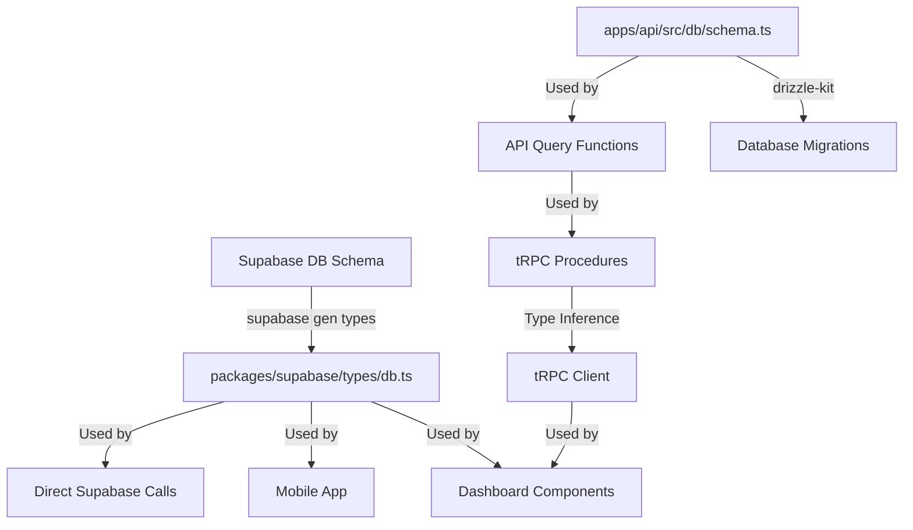

```mermaid
graph TD
    A[Supabase DB Schema] -->|supabase gen types| B[packages/supabase/types/db.ts]
    C[apps/api/src/db/schema.ts] -->|drizzle-kit| D[Database Migrations]
    
    B -->|Used by| E[Dashboard Components]
    B -->|Used by| F[Mobile App]
    B -->|Used by| G[Direct Supabase Calls]
    
    C -->|Used by| H[API Query Functions]
    H -->|Used by| I[tRPC Procedures]
    I -->|Type Inference| J[tRPC Client]
    J -->|Used by| E
```